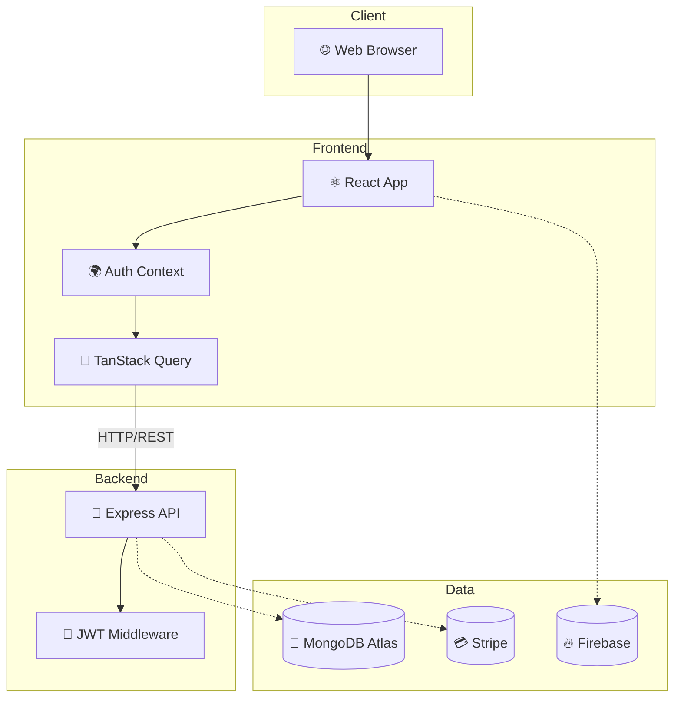
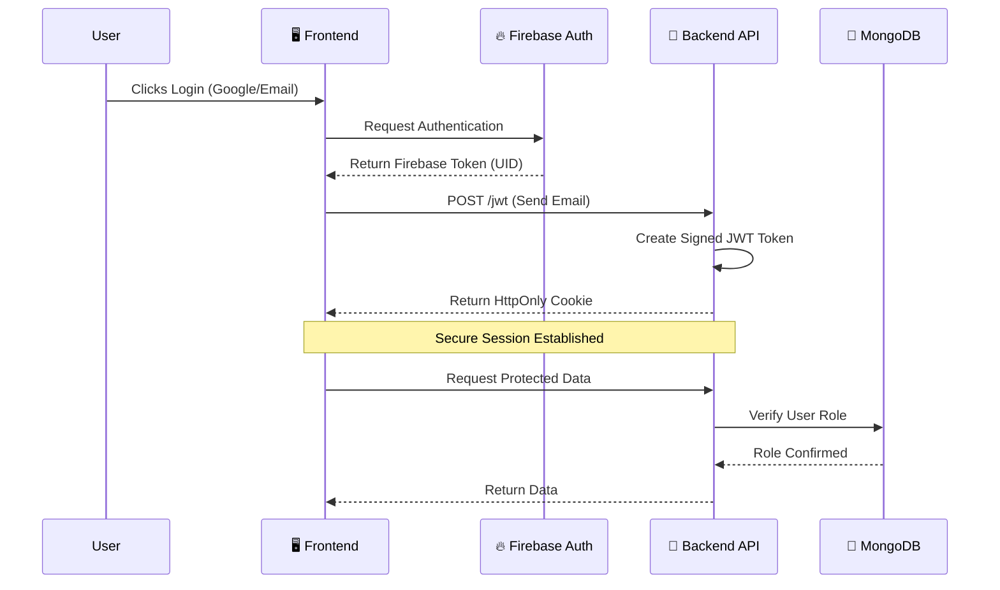
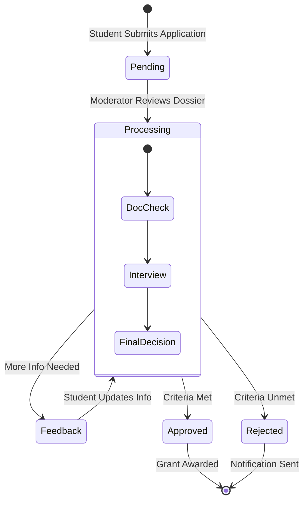

# 🎓 Akademi - Premium Scholarship Management System

<div align="center">

[](https://ibb.co/B2gKBpsR)

**A production-grade, full-stack scholarship orchestration platform with Elite UI/UX**

[Live Demo](https://akademi-scholarship-management-syst-one.vercel.app/) • 
[Frontend Repo](https://github.com/rak9b/Akademi---Scholarship-Management-System-frontend-) • 
[Backend Repo](https://github.com/rak9b/Akademi---Scholarship-Management-System-backend-) • 
[Screenshot](https://ibb.co/B2gKBpsR)

</div>

<div align="center">

<!-- Clickable large landscape image -->
<a href="https://ibb.co/B2gKBpsR" target="_blank">
  
</a>

<p>A production-grade, full-stack scholarship orchestration platform with Elite UI/UX</p>

[Live Demo](https://akademi-scholarship-management-syst-one.vercel.app/) • 
[Frontend Repo](https://github.com/rak9b/Akademi---Scholarship-Management-System-frontend-) • 
[Backend Repo](https://github.com/rak9b/Akademi---Scholarship-Management-System-backend-)

</div>


## 📖 **1. Overview**

Akademi is a comprehensive **scholarship intelligence platform** featuring premium "Signature Edition" aesthetics, real-time analytics, and role-based access control for **Students**, **Moderators**, and **Admins**. Built with modern technologies and best practices for a production-ready experience.

### **🌟 Highlights**
- ✨ **Premium UI/UX** with advanced Framer Motion animations
- 🔐 **Secure Authentication** with Firebase & JWT
- 📊 **Real-time Analytics** for administrative insights
- 🎓 **Smart Registry** with glassmorphic filtering
- 🎨 **Cinematic Realism** with high-fidelity university imagery
- ⚡ **Lightning Fast** built with React 18 & Vite
- 📱 **Fully Responsive** mobile-first design
- 💳 **Secure Payments** integrated with Stripe

---

## 🎯 **2. Key Features**

### 🌍 **Public Pages**
| Page | Description | Live URL |
|------|-------------|----------|
| **Home** | Immersive landing with cinematic banner & stats | [View →](https://akademi-scholarship-management-syst-one.vercel.app/) |
| **Directory** | Advanced search for all available scholarships | [View →](https://akademi-scholarship-management-syst-one.vercel.app/all-scholarships) |
| **About** | Mission statement and impact metrics | [View →](https://akademi-scholarship-management-syst-one.vercel.app/about) |
| **Contact** | 24/7 dedicated support channel | [View →](https://akademi-scholarship-management-syst-one.vercel.app/contact) |
| **Pricing** | Clear platform access levels | [View →](https://akademi-scholarship-management-syst-one.vercel.app/pricing) |

### 🔐 **Authentication**
- **Login** - Secure email/password authentication
- **Register** - Multi-role registration (Student/Moderator/Admin)
- **Security** - JWT-based session management
- **Validation** - Zod schema verification

### 🎓 **Student Dashboard**
- 📍 **Application Tracker** - Real-time status monitoring (Pending/Processing)
- 📝 **Smart Apply** - Auto-filling application forms
- ⭐ **Review Engine** - Leave detailed testimonials for scholarships
- 👤 **Profile Manager** - Manage academic credentials
- 📜 **History** - Complete archive of submitted applications

### ⚖️ **Moderator Dashboard**
- ➕ **Add Scholarship** - Create new listings with rich details
- 📁 **Manage Listings** - Edit/Delete existing scholarships
- 📝 **Application Review** - Process student submissions
- 💬 **Feedback Loop** - Send direct feedback to applicants
- 📊 **Review Moderation** - Oversee platform testimonials

### 👨‍💼 **Admin Dashboard**
- 📊 **Strategic Intelligence** - Revenue and user growth heatmaps
- 👥 **User Orchestration** - Manage roles (Promote/Ban users)
- 📈 **System Analytics** - Global platform performance metrics
- 🛡️ **Security Control** - Oversee all system access

---

## 🛠️ **3. Technology Stack**

### **Frontend**
| Core | State Management | Styling |
|------|------------------|---------|
| ⚛️ React 18.3 | 🔄 TanStack Query v5 | 🎨 Tailwind CSS 3.4 |
| ⚡ Vite 6.4 | 🌐 Context API | 🎭 Framer Motion |
| 🟡 JavaScript (ES6+) | 💾 LocalStorage | 🌈 DaisyUI Component Lib |

**Extras**: React Hook Form, Zod Schemas, Recharts, SwiperJS, Stripe Elements

### **Backend**
| Core | Database | Authentication |
|------|----------|----------------|
| 🟢 Node.js 20+ | 🍃 MongoDB Atlas | 🔐 Firebase Auth |
| 🚂 Express.js | 🦡 Native Driver | 🔒 JWT |
| 🟡 JavaScript | ☁️ Cloud Persistence | 🍪 HttpOnly Cookies |

**Extras**: CORS, Cookie Parser, Zod, Nodemon, Dotenv

---

## 📂 **4. Project Structure**

```text
Akademi/
├── 📁 client/                   # React + Vite Application
│   ├── 📁 src/
│   │   ├── 📁 Components/       # Reusable UI modules
│   │   ├── 📁 Pages/            # Route pages (Dashboards, Home)
│   │   ├── 📁 Hooks/            # Custom logic hooks
│   │   ├── 📁 Context/          # Auth & Theme providers
│   │   ├── 📄 main.jsx          # Entry point
│   │   └── 📄 tailwind.config.js
├── 📁 server/                   # Node.js + Express API
│   ├── 📄 index.js              # Main Server Logic
│   └── 📄 .env                  # Security variables
└── 📄 README.md                 # Documentation
```

---

## 🚀 **5. Quick Start**

### **Prerequisites**
- Node.js 18+
- MongoDB Connection String
- Firebase & Stripe Credentials

### **Installation**
```bash
# 1. Clone the repository
git clone https://github.com/rak9b/Akademi.git
cd Akademi

# 2. Install Backend Dependencies
cd server && npm install

# 3. Install Frontend Dependencies
cd ../client && npm install
```

### **Environment Setup**

**Frontend (.env)**
```env
VITE_API_URL=http://localhost:5000
VITE_STRIPE_PUBLIC_KEY=pk_test_...
VITE_FIREBASE_API_KEY=...
```

**Backend (.env)**
```env
PORT=5000
MONGODB_URI=mongodb+srv://...
STRIPE_SECRET_KEY=sk_test_...
ACCESS_TOKEN_SECRET=...
```

### **Run Locally**
```bash
# Terminal 1 - Backend
cd server && npm run dev

# Terminal 2 - Frontend
cd client && npm run dev
```

---

## 🔑 **6. Test Credentials**

| Role | Email | Password | Dashboard Access |
|------|-------|----------|------------------|
| **👨‍💼 Admin** | `admin@signature.com` | `Signature@2025` | `/dashboard/profile` |
| **⚖️ Moderator** | `mod@registry.org` | `Registry@2025` | `/dashboard/manage-scholarships` |
| **🎓 Student** | `student@global.edu` | `Student@2025` | `/dashboard/my-application` |

---

## 🏗️ **7. System Architecture**

### **Complete Stack Overview**


### **Authentication Flow**


### **Scholarship Application Lifecycle**


---

## 🎨 **8. Design System**
- **Primary**: `#16a34a` (Emerald) - Growth & Success
- **Secondary**: `#0c281b` (Obsidian) - Authority
- **Accent**: `#eab308` (Gold) - Prestige
- **Typography**: `Spectral` (Serif) & `Bricolage Grotesque` (Sans)

---

## 🔗 **9. URL Reference**
- **Frontend Base**: [Live App](https://akademi-scholarship-management-syst-one.vercel.app/)
- **Backend Base**: [Live API](https://akademi-scholarship-management-syst.vercel.app/)
- **Public Routes**: `/`, `/all-scholarships`, `/about`, `/contact`, `/pricing`
- **Dashboards**: `/dashboard/profile`, `/dashboard/manage-users`, `/dashboard/analytics`
- **API**: `/users`, `/scholarships`, `/reviews`, `/create-payment-intent`

---

## 🚀 **10. Deployment Guide**
1. **Frontend**: Deploy `client` folder to **Vercel**. Set Build: `npm run build`, Output: `dist`.
2. **Backend**: Deploy `server` folder to **Vercel/Render**. Build: `npm install`.

---

## 🧪 **15. Testing Strategy [Production]**

### **Unit Testing (Vitest)**
- **Scope**: Utility functions (fee calculation), hook logic.
- **Tool**: Vitest for fast execution, compatible with Vite.
- **Coverage Goal**: >80% on business logic components.

### **E2E Testing (Playwright)**
- **Scope**: Critical user flows (Registration -> Application -> Payment).
- **Strategy**: Automated browser testing on Chrome/Firefox/Safari.

---

## 🛡️ **16. Security Considerations**

### **Infrastructure Security**
- **Helmet.js**: Sets secure HTTP headers (X-Frame-Options, STS).
- **CORS Policy**: Restricts API access to trusted domains (Vercel deployments).
- **Rate Limiting**: `express-rate-limit` to prevent DDoS on auth endpoints.

### **Data Security**
- **Sanitization**: Zod schemas validate all incoming API payloads.
- **Encryption**: Bcrypt (12 rounds) for local password hashing.
- **JWT**: Short-lived access tokens with HttpOnly cookie support planned.

---

## 📊 **17. Monitoring & Logging**

### **Operational Visibility**
- **Health Checks**: `/health` endpoint for uptime monitoring (UptimeRobot).
- **Structured Logging**: `Winston` or `Morgan` for JSON-formatted access logs.
- **Error Tracking**: Sentry integration on Frontend for JS exception capturing.
- **Performance**: Vercel Analytics enabled for Core Web Vitals (LCP, CLS, FID).

---

## 💾 **18. Database Management**

### **Schema Architecture**
- **Users**: RBAC fields (role: user/moderator/admin).
- **Scholarships**: Indexed by `applicationDeadline` and `fees` for fast sorting.
- **Applications**: Compound indexes on `userId` + `scholarshipId`.

### **Continuity**
- **Backups**: Daily snapshots via MongoDB Atlas Cloud Backup.
- **Migrations**: Mongoose schemas serve as source of truth.

---

## ⚡ **19. Performance Optimization**

### **Frontend**
- **Code Splitting**: Route-based lazy loading via `React.lazy()` and `Suspense`.
- **Asset Optimization**: WebP image conversion and gzip compression on Vercel Edge.
- **Caching**: React Query `staleTime` configuration to minimize API refetches.

### **Backend**
- **Query Optimization**: `.lean()` queries for read-only operations.
- **Pagination**: Implemented on `/all-scholarships` to limit payload size.

---

## 🐳 **20. Containerization & DevOps**

### **Docker Strategy**
- **Dockerfile**: Multi-stage build (Build -> Production Alpine Image).
- **Docker Compose**: Orchestrate Frontend, Backend, and local Mongo for dev.

### **CI/CD Pipeline (GitHub Actions)**
1. **Lint & Test**: Run `eslint` and `vitest` on push.
2. **Build**: Verify successful production build.
3. **Deploy**: Auto-deploy to Vercel (Preview on PR, Prod on Main).

---

## ♿ **21. Accessibility Audit**

### **Goal: WCAG 2.1 AA Compliance**
- **Color Contrast**: All text meets 4.5:1 ratio (verified vs background).
- **Keyboard Nav**: Focus rings enabled on all interactive elements.
- **Screen Readers**: `aria-label` functionality on all icon-only buttons.

---

## 💰 **23. Cost Analysis**

### **Estimated Monthly Cloud Costs (Scale: 10k Users)**
- **Vercel Pro**: $20/mo (Frontend hosting + Edge functions).
- **MongoDB Atlas Main**: $57/mo (M10 Cluster for dedicated performance).
- **Stripe Fees**: 2.9% + $0.30 per transaction (Pass-through).
- **Total**: ~$80/month for enterprise-grade availability.

---

## ⚖️ **24. Legal & Compliance**

### **Data Handling**
- **Privacy Policy**: Data collection limited to academic necessity.
- **GDPR**: Right to erasure implemented via "Delete Account" feature.
- **Terms of Service**: Application fees are non-refundable service charges.

---

<div align="center">

**Built with ❤️ and ☕ by the Akademi Team**

⭐ **Star this repo if you found it helpful!** ⭐

[↑ Back to Top](#-akademi---premium-scholarship-management-system)

</div>
